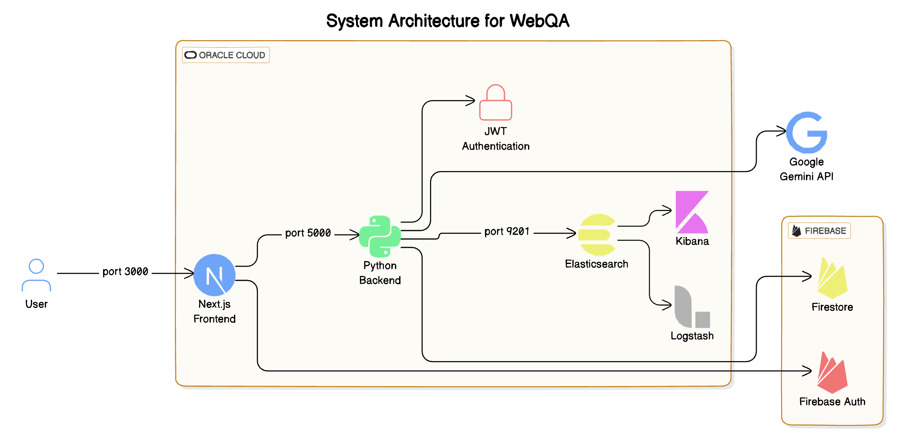

## System architecture



## How to run

At the top of parent directory, run

```bash
cd client
npm i
npm run dev
```

At the top directory, run

```bash
cd core
pip install -r deploy_req.txt
cd ../
flask --app core/app.py run
```

## Docker Setup and Installation

1. Make sure Docker and Docker Compose are installed on your machine. If not, you can download them from [Docker's official website](https://www.docker.com/products/docker-desktop).

2. Clone the repository.

3. Build and run the Docker containers using Docker Compose. Navigate to the root directory of the project where the `docker-compose.yml` file is located and run the following command:

```sh
docker compose up --build -d
```

This command will build the Docker images for the server and client services defined in the docker-compose.yml file, and then start the containers.

4. The server will be running at http://localhost:5000 and the client will be running at http://localhost:3000.
